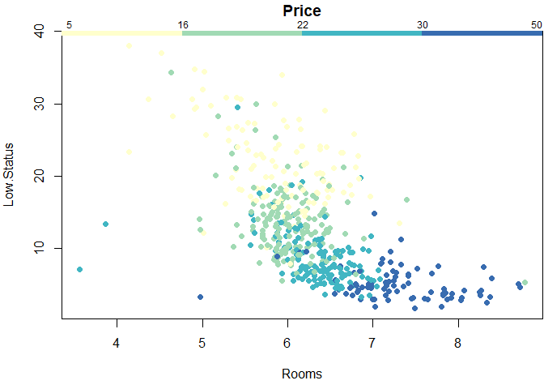

The R datamining package
================

This is a packaged collection of R functions for data mining originally
developed by Thomas Minka for [teaching at
CMU](http://alumni.media.mit.edu/~tpminka/courses/36-350/).

There are many other packages on CRAN that can replicate this
functionality. However, the idea of using visualisation to build
regression models is attractive, and the package only depends on base R.

## Installation

You can install the package in RStudio using the `devtools` package:

``` r
if (!require(devtools)) install.packages("devtools")
devtools::install_github("paulemms/datamining")
```

## Usage

``` r
library(datamining)
packageVersion("datamining")
```

    ## [1] '1.0.0'

The package contains a number of example data sets. The data below is a
modified version of the `Boston` data set in the `MASS` package.

``` r
data(Housing)
head(Housing)
```

    ##     Crime Industry Pollution Rooms  Old Distance Highway Tax
    ## 1 0.00632     2.31     0.538 6.575 65.2   4.0900       1 296
    ## 2 0.02731     7.07     0.469 6.421 78.9   4.9671       2 242
    ## 3 0.02729     7.07     0.469 7.185 61.1   4.9671       2 242
    ## 4 0.03237     2.18     0.458 6.998 45.8   6.0622       3 222
    ## 5 0.06905     2.18     0.458 7.147 54.2   6.0622       3 222
    ## 6 0.02985     2.18     0.458 6.430 58.7   6.0622       3 222
    ##   Student.Teacher.Ratio Low.Status Price
    ## 1                  15.3       4.98  24.0
    ## 2                  17.8       9.14  21.6
    ## 3                  17.8       4.03  34.7
    ## 4                  18.7       2.94  33.4
    ## 5                  18.7       5.33  36.2
    ## 6                  18.7       5.21  28.7

An example plot is shown below.

``` r
color.plot(Price ~ Rooms + Low.Status, Housing, color.palette=YlGnBu.colors)
```

<!-- -->
